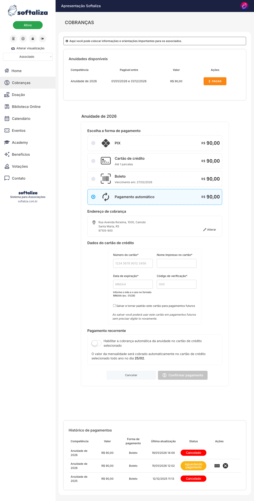
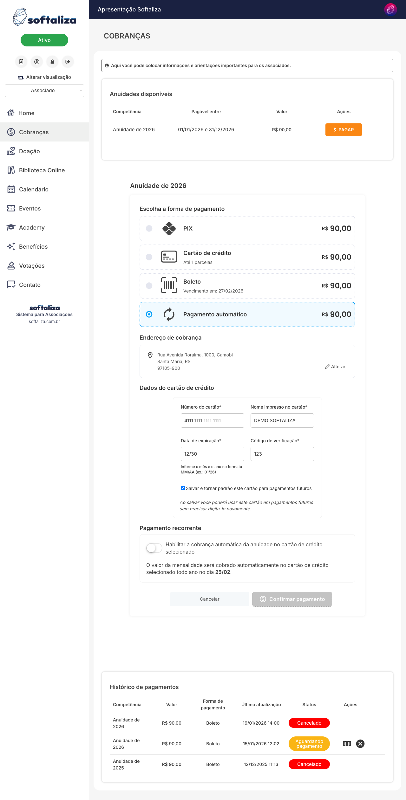
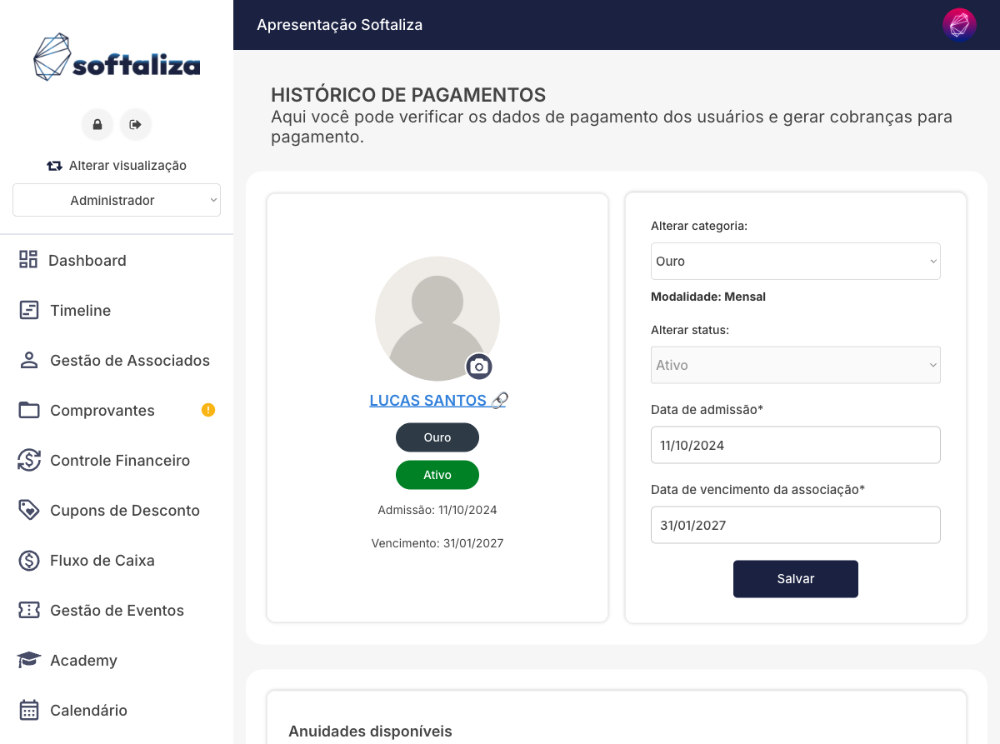
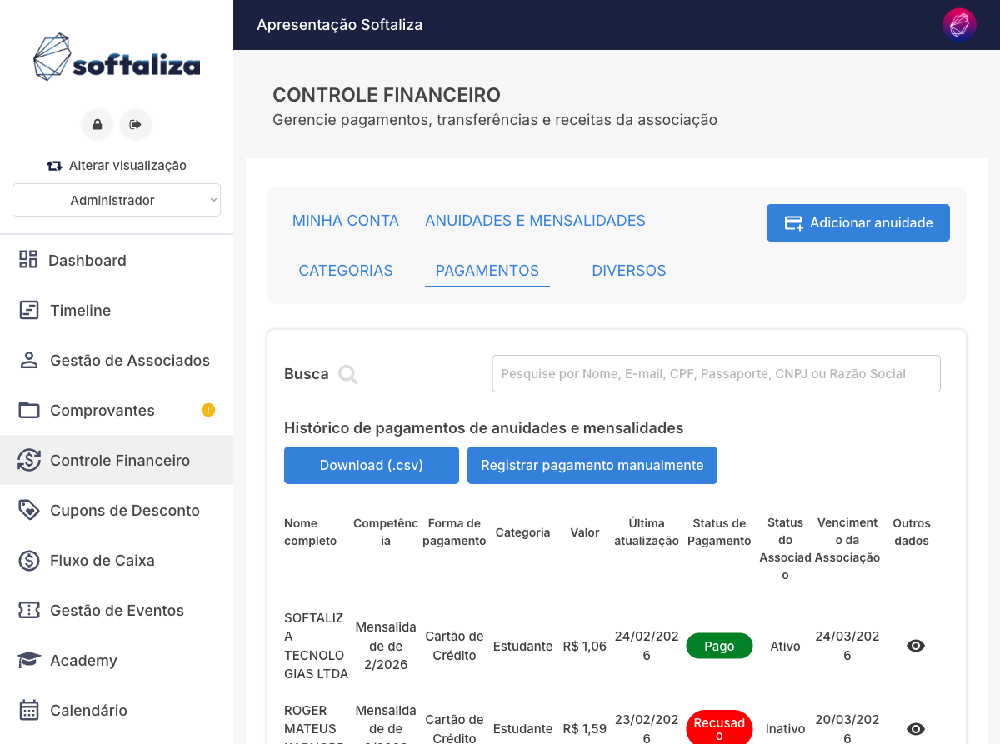
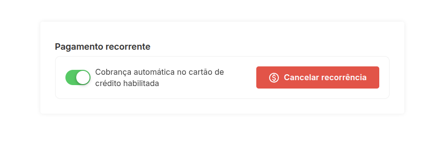
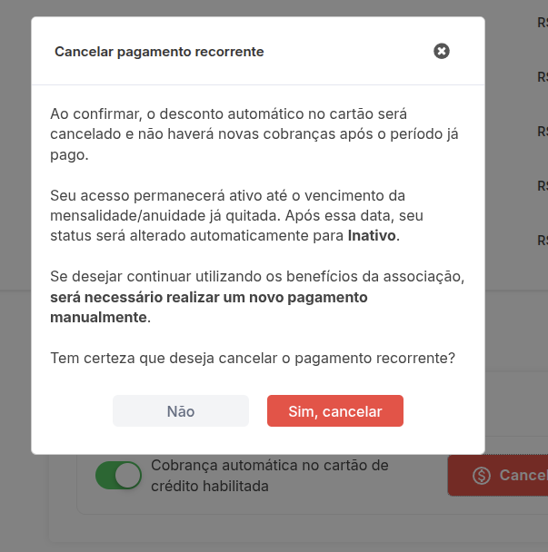

# Pagamento automático por cartão (recorrência)

Este tutorial apresenta, de forma objetiva, como funciona a recorrência por cartão no ambiente de demonstração da Softaliza. A funcionalidade permite que a associação cobre automaticamente mensalidades ou anuidades no cartão do associado, conforme a configuração financeira da categoria.

Importante: a associação define quais meios de pagamento ficam disponíveis por modalidade/categoria. Dependendo da configuração, o associado pode visualizar **PIX, boleto, cartão de crédito e pagamento automático**, ou apenas **pagamento automático**. Esse ajuste é feito no painel administrativo e impacta diretamente a experiência do associado na área restrita.

## 1) Como o associado ativa a recorrência

Na área restrita do associado, acesse **Cobranças** e clique em **Pagar** na competência disponível. Em seguida, selecione **Pagamento automático**.

Nessa etapa, o sistema exibe a forma de cobrança automática para a competência ativa e abre os campos do cartão. Quando a categoria estiver configurada com múltiplos meios, aparecem também as outras opções (PIX, boleto e cartão avulso). Já em categorias configuradas para recorrência exclusiva, o associado verá somente o bloco de pagamento automático, mantendo o fluxo mais simples e padronizado.

## 2) Como salvar o cartão para uso futuro

Ao preencher os dados do cartão, marque a opção de armazenamento para não precisar redigitar em cobranças futuras.

Essa opção facilita renovações e reduz fricção no pagamento recorrente. O cartão salvo pode ser usado como padrão para próximos lançamentos, conforme regras da conta e do gateway integrado. Na prática, o associado não precisa digitar o cartão em toda cobrança futura, reduzindo abandono no pagamento e chamados de suporte relacionados a renovação.

## 3) Confirmação da adesão recorrente

Com os dados preenchidos e a recorrência habilitada, avance para **Confirmar pagamento**.

No demo, a confirmação visual pode variar conforme o cenário (ex.: botão habilitado/desabilitado por validação de campos). Em produção, após confirmação e autorização do meio de pagamento, a assinatura/cobrança recorrente passa a seguir o ciclo da competência (mensal ou anual).

Regra operacional esperada:
- **Mensalidade**: a plataforma agenda a próxima cobrança automaticamente no ciclo mensal configurado para a categoria.
- **Anuidade**: a cobrança fica vinculada ao período anual da associação, com renovação conforme regras da modalidade anual.

Assim, a recorrência funciona como uma autorização contínua para que o sistema execute novas cobranças dentro do calendário da associação, sem exigir nova ação manual do associado a cada competência.

## 4) Onde visualizar a recorrência no associado

No painel administrativo, em **Gestão de Associados > Histórico de pagamentos** do associado, é possível consultar os dados cadastrais e as cobranças vinculadas ao perfil.

Essa visualização é o ponto principal para suporte operacional: valida categoria/modalidade, status e histórico da jornada de cobrança do associado. É também onde o time administrativo normalmente confere dados de admissão, vencimento e enquadramento antes de tratar ajustes de cobrança.

## 5) Onde visualizar a recorrência no financeiro

Em **Controle Financeiro > Pagamentos**, a associação acompanha os lançamentos, forma de pagamento e status (ex.: pago, recusado, aguardando).

Essa tela consolida o acompanhamento financeiro e permite monitorar comportamento da recorrência em escala, com filtros e ações administrativas. Com essa visão, a equipe acompanha rapidamente quais pagamentos foram liquidados, recusados ou pendentes, e consegue priorizar ações de reprocessamento e contato com associados quando necessário.

## 6) Como cancelar a recorrência

Quando a recorrência já está ativa, o associado pode cancelar diretamente na seção **Pagamento recorrente**, clicando no botão **Cancelar recorrência**.

Após clicar em cancelar, o sistema abre um modal de confirmação explicando os efeitos do cancelamento:
- não haverá novas cobranças automáticas após o período já pago;
- o acesso permanece ativo até o vencimento da mensalidade/anuidade quitada;
- para continuar depois disso, será necessário realizar novo pagamento manual.

Para concluir, o usuário confirma em **Sim, cancelar**.  
Observação: este passo está documentado com base na interface exibida no sistema e no texto de confirmação apresentado em tela.
