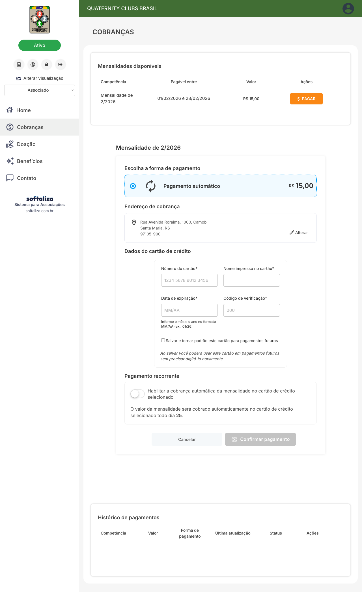
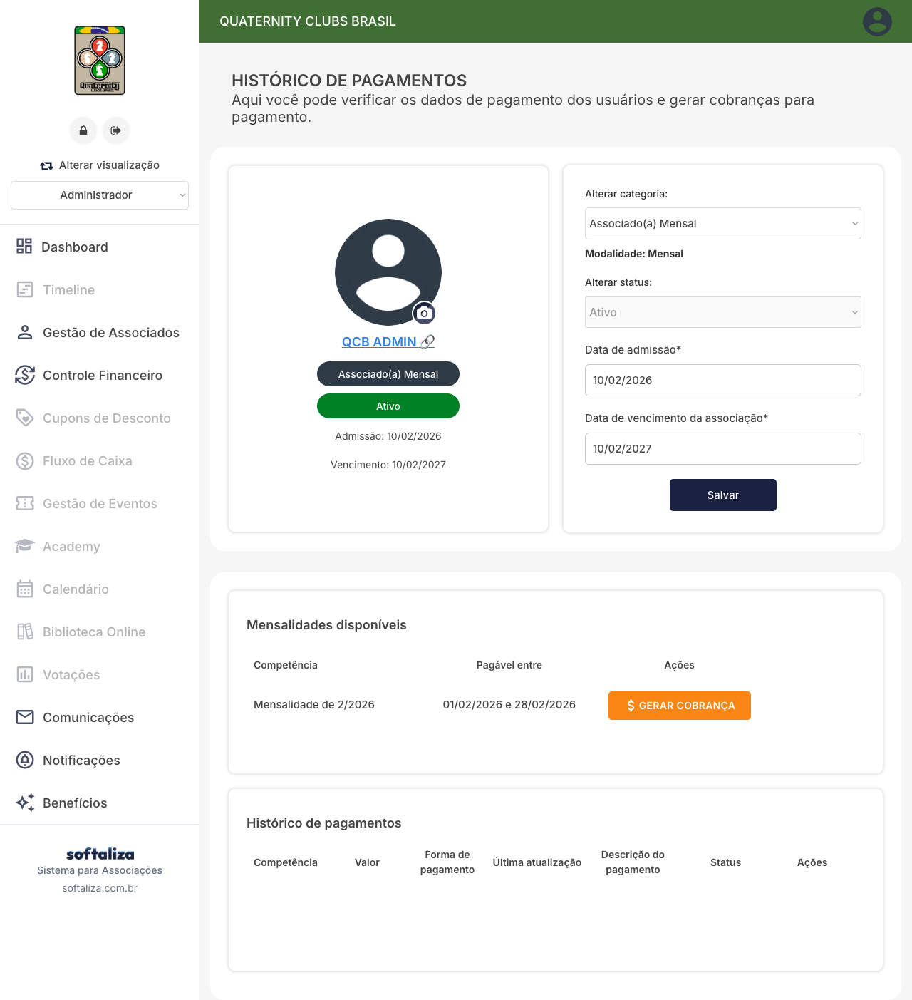
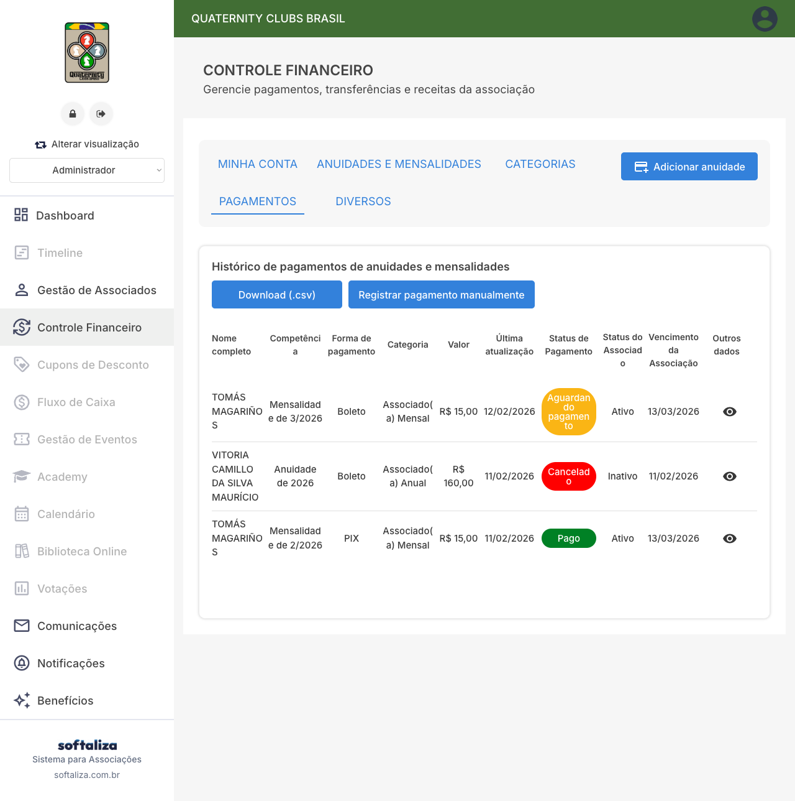

# Pagamento automático por cartão (recorrência) – cenário Sócio Mensal (QCB)

## Descrição breve da funcionalidade
Neste cenário validado no ambiente QCB, o associado está na modalidade **Associado(a) Mensal** e, na etapa de cobrança, a plataforma apresenta **somente a opção de Pagamento automático** via cartão para a mensalidade vigente. Isso significa que a recorrência já está aplicada como padrão operacional para a modalidade ativa, reduzindo o risco de inadimplência por esquecimento e simplificando a manutenção da associação.

Também é importante registrar a regra de negócio observada: a associação pode configurar, conforme a modalidade, quais meios ficam disponíveis ao associado. Dependendo da parametrização, a tela pode exibir **Pix, boleto e cartão de crédito** ou, como neste caso mensal, **apenas pagamento automático**.

## Como o associado ativa a recorrência (mensal)

Caminho: **Associado > Cobranças > PAGAR**.

Na competência mensal exibida, o bloco **Escolha a forma de pagamento** mostra apenas **Pagamento automático**. Ao selecionar essa opção, o sistema abre os blocos de endereço, dados de cartão e pagamento recorrente.

Operacionalmente, esse comportamento indica que a recorrência já foi definida pela associação para esta modalidade e não depende de escolher entre múltiplos meios naquela tela específica. Em outros contextos/configurações, o associado pode visualizar alternativas adicionais (Pix, boleto, cartão sem recorrência), conforme política definida pela entidade.

## Como salvar o cartão para uso futuro

No bloco de dados de cartão, marque a opção:
**“Salvar e tornar padrão este cartão para pagamentos futuros”**.

Essa ação registra o cartão para reutilização, evitando redigitação a cada cobrança. Em termos práticos, melhora a experiência do associado e reduz fricção em renovações futuras. Para suporte e comunicação institucional, recomenda-se orientar que o associado mantenha cartão válido, com limite e data de expiração atualizados, para evitar falhas automáticas de cobrança.

## Como funciona a cobrança automática mensal

Após preencher **número do cartão**, **nome impresso**, **validade** e **CVV**, o associado confirma em **Confirmar pagamento**.

No ambiente validado, o texto de recorrência informa cobrança automática da mensalidade em dia específico do mês. O ciclo é executado de forma automática com base na competência mensal cadastrada no financeiro. Em caso de insucesso (cartão inválido, limite, vencimento), o status e a tratativa devem ser acompanhados pelo administrativo nas telas de pagamentos/histórico.

## Onde visualizar a recorrência no sistema

No cadastro administrativo do associado (tela **Histórico de Pagamentos**), é possível confirmar:
- modalidade ativa (neste caso, **Mensal**);
- competências disponíveis para cobrança;
- tabela de histórico (competência, forma, status e atualização).

Esse é o ponto mais direto para suporte individual, validação de situação cadastral e conferência de cobrança por associado.

No painel **Controle Financeiro > PAGAMENTOS**, a associação acompanha visão consolidada de cobranças (mensais e anuais), status, formas de pagamento e vencimentos. Essa tela é a referência de operação para monitoramento diário e tratamento de pendências.

## Observações técnicas relevantes
- As evidências foram capturadas em telas reais do ambiente QCB no cenário de **Associado(a) Mensal**.
- Na tela de cobrança mensal, a plataforma exibiu **somente Pagamento automático** como forma disponível.
- A associação pode disponibilizar, por modalidade, combinações como Pix/Boleto/Cartão ou apenas automático, conforme configuração financeira.
- Na validação da interface, não houve popup de confirmação explícito; por isso, a confirmação operacional deve considerar o histórico do associado e o painel financeiro.
